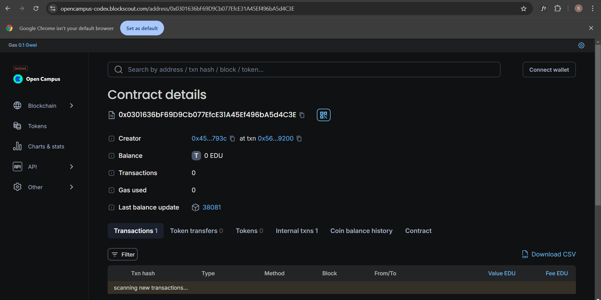

# Attendify Chain
## Student registery smart contract

## Vision

The `StudentRegistry` smart contract aims to streamline the management of student records and attendance in an efficient and decentralized manner. By leveraging blockchain technology, this project ensures transparent and tamper-proof record-keeping while automating reward distribution based on attendance.

## Project Features

- **Student Registration:** Allows students to register with their personal details including name, email, mobile number, and roll number.
- **Attendance Tracking:** Enables students to mark their attendance, which is recorded and updated in the blockchain.
- **Automatic Rewards:** Provides Ether rewards to students whose attendance exceeds a predefined threshold (more than 5 days).
- **View Student Information:** Retrieve detailed information and attendance records for any registered student.
- **Contract Funding:** Allows funding the contract with Ether to support the reward mechanism.
- **Funds Management:** The contract owner can withdraw Ether from the contract as needed.

## Future Scope

1. **Enhanced Reward System:** Implement a tiered reward system based on different attendance thresholds or performance metrics.
2. **Attendance Analytics:** Introduce functions to generate detailed attendance reports and analytics.
3. **Integration with Web Interfaces:** Develop a user-friendly web interface for easier interaction with the contract.
4. **Student Authentication:** Add authentication mechanisms for secure student access and interaction.
5. **Multi-level User Roles:** Introduce roles such as admins, instructors, and students with varying permissions and functionalities.
6. **Gas Optimization:** Optimize gas usage to make the contract more efficient and cost-effective.

## Project Structure

1. **Smart Contract Code:**
   - `StudentRegistry.sol`: The main contract file containing all the logic for student registration, attendance tracking, rewards, and fund management.

2. **Development and Testing:**
   - **Tools:** Remix IDE, Truffle, Hardhat
   - **Testing:** Write and execute unit tests to ensure contract functionality and security.

3. **Deployment:**
   - **Networks:** Deploy on Ethereum test networks (e.g., Rinkeby, Ropsten) or mainnet.
   - **Scripts:** Deployment scripts to automate contract deployment and initial setup.

4. **Documentation:**
   - **README.md:** Provides an overview, features, and usage instructions for the project.
   - **API Documentation:** Document the contract's functions and events for developers integrating with it.

5. **User Interface (Future Scope):**
   - **Web Interface:** Develop a web application for interacting with the smart contract, including functionalities for student registration, attendance marking, and rewards management.

## Developer Details

- **Name:** [Siddhi Pogakwar]
- **Email:** [pogakwarsiddhi10@gmail.com]

## Deployment
Chain Name: Educhain Open Campus
Contract Id: 0x0301636bf69d9cb077efce31a45ef496ba5d4c3e

